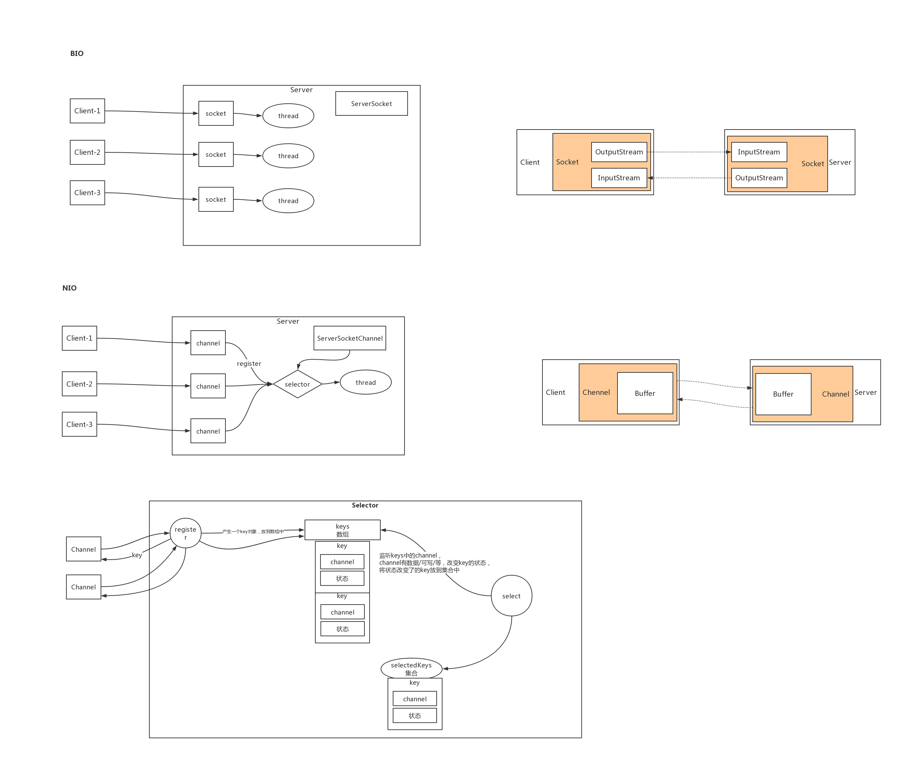
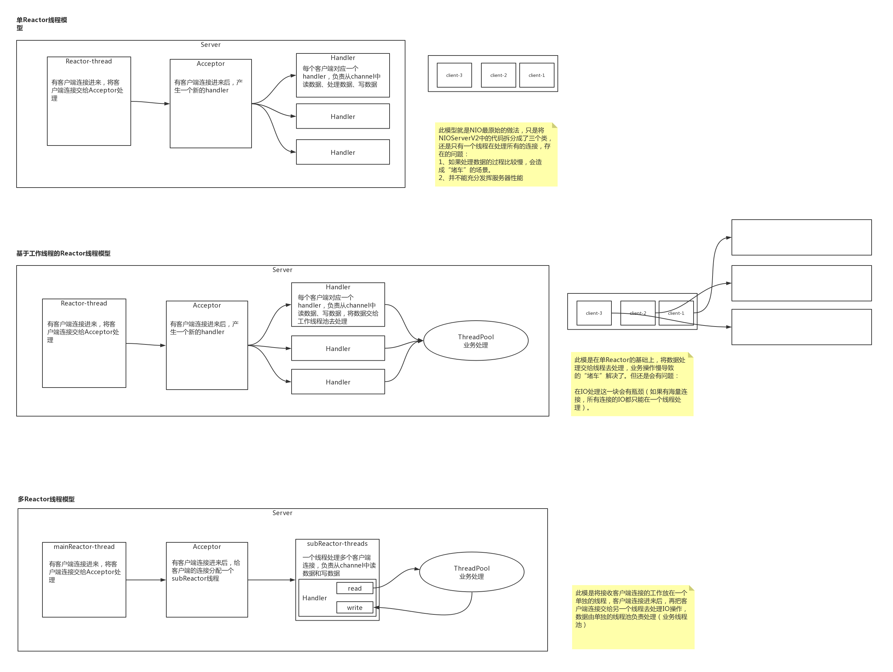
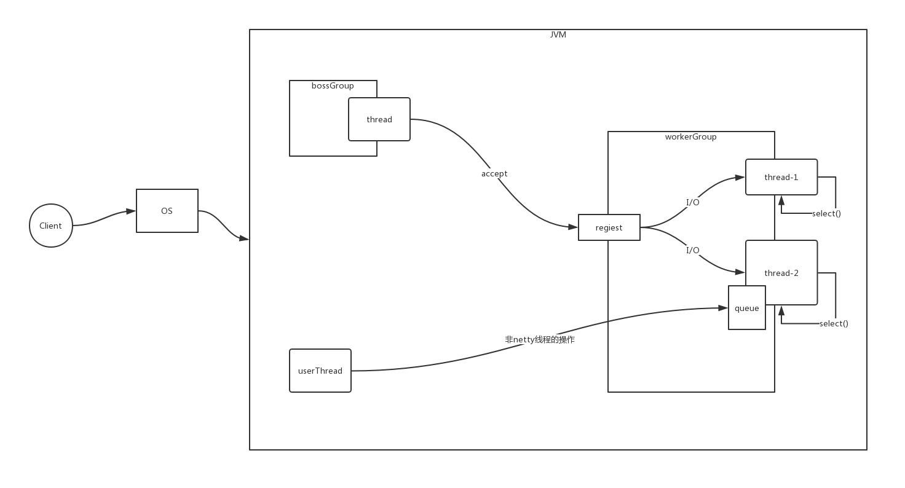
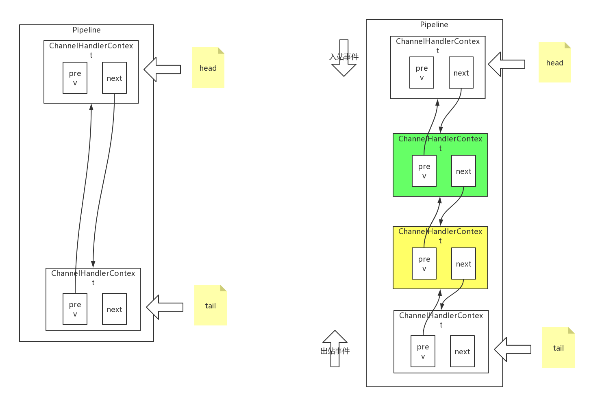
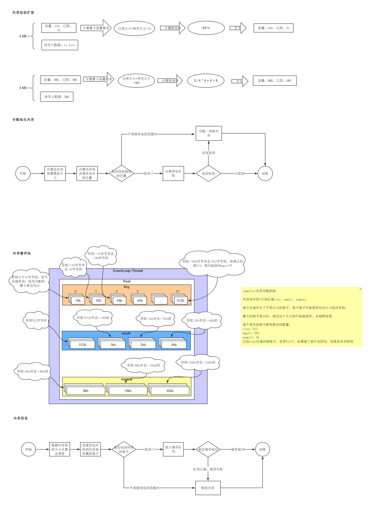
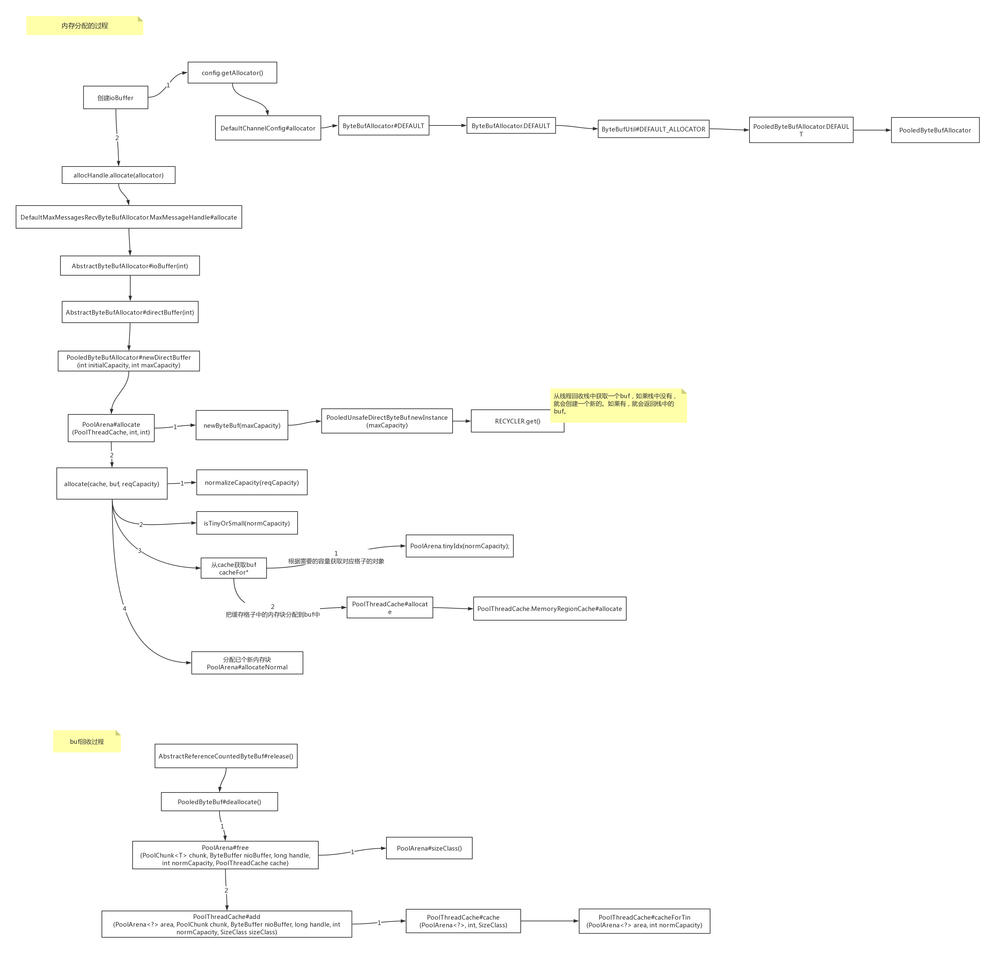

# IO
## 1 BIO
BIO 为同步阻塞IO,在java中表现形式为Socket和ServerSocket  
[BIO服务端代码示例](src/main/java/com/example/study/bio/BIOServer.java)  
[BIO客户端代码示例](src/main/java/com/example/study/bio/BIOClient.java)

## 2 NIO(重点)
NIO 为同步非阻塞IO，

在java中主要有三个核心

1. Buffer缓冲区  
    1. 概述
       ```text
       缓冲区本质上是一个可以写入数据的内存块(类似数组),然后可以再次读取.
       此内存块包含在NIO Buffer对象中,该对象提供了一组方法,可以更轻松的使用内存块.
       使用Buffer进行数据写入和读取,需要进行四个步骤:
       1.数据写入缓冲区
       2.调用buffer.flip(),转换为读取模式
       3.缓冲区读取数据
       4.调用buffer.clear()或buffer.compact()转为写模式
       ```
    2. 工作原理
       ```text
       Buffer三个重要属性:
       capacity(容量): 作为一个内存块,buffer具有一定的固定大小
       position(位置): 写入模式是代表写数据的位置.读取模式是代表读取数据的位置
       limit(限制): 写入模式下,limit等于容量. 读取模式下,limit等于写入的数据量
       ```
    3. ByteBuffer内存模型
       ```text
       ByteBuffer为性能关键型代码提供了直接内存(direct堆外)和堆内内存两种实现.
       堆外内存获取的方式: ByteBuffer.allocateDirect(noBytes);
       
       好处：
       1. 进行网络IO或者文件IO时比heapBuffer少一次拷贝(file/socket --- os memory --- jvm heap)
       GC会移动对象内存,在写file或socket的过程中,jvm的视线中会先把数据复制到堆外,在进行写入.
       2. GC范围之外,降低GC压力,但实现了自动管理. DirectByteBuffer中有一个Cleaner对象
       (PhantomReference),Cleaner被GC前会执行clean方法,触发DirectByteBuffer中定义的Deallocator
       ```
2.  Channel 通道
    
    网络数据传输通道
    1. SocketChannel
        ```text
        用于建立TCP网络连接，类似于 Socket
        ```
    2. ServerSocketChannel
       ```text
       监听新建的TCP连接通道 类似ServerSocket
       ```
3.  Selector 选择器
用来检查一个或多个NIO通道,并确定哪些通道已经准备好进行读取或者写入.
实现单个线程可以管理多个通道,从而管理多个网络连接

**Selector监听多个channel的事件**
```text
1. Connect连接(SelectionKey.OP_CONNECT)
2. Accept就绪(SelectionKey.OP_ACCEPT)
3. Read读取(SelectionKey.OP_READ)
4. Write写入(SelectionKey.OP_WRITE)
```

## 3 NIO BIO 工作流程


## 4 NIO Reactor线程模型
**reactor 线程模型 图示**


## 5 Netty
netty 核心组件
```text
Channel：Netty中自己定义的Channel，增强版的通道概念
EventLoop：由线程驱动，处理Channel的所有I/O事件
ChannelPipeline：事件处理机制
ChannelHandler：事件处理器
ByteBuf：增强的ByteBuf缓冲区
Bootstrap：启动器，引导Netty应用程序启动
```

### 5.1 netty 线程模型
```text
为了让NIO处理，更好的利用多线程特性，Netty实现了Reactor线程模型。
Reactor模型中有四个核心概念：
1) Resources 资源(请求/任务)
2) Synchronous Event Demultiplexer 同步事件复用器
3) Dispatcher 分配器
4) Request Handler 请求处理器
```


### 5.2 EventLoop
[EventLoop创建和启动过程](image/Netty-EventLoop.png)

### 5.3 Channael
```text
netty中的Channel是一个抽象的概念，可以理解为对JDK NIO Channel的增强和拓展。
增加了很多属性和方法
完整信息可以看 AbstractChannel
```
### 5.4 pipeline
netty中的pipeline是一个双向通道,双向责任链
下图是pipeline的内部结构

**netty中pipeline的四个重点**
1. 处理器抽象类
2. 具体的处理器实现类
3. 保存处理器信息
4. 处理执行

#### 5.4.1 出入站事件
```text
入站事件：通常指I/O线程生成了入站数据。
（通俗理解：从socket底层自己往上冒上来的事件都是入站）
比如EventLoop收到selector的OP_READ事件，入站处理器调用socketChannel.read(ByteBuffer)
接收到数据后，这将导致通道的ChannelPipeline中包含的下一个中的channelRead方法被调用。

出站事件：经常是指I/O线程执行实际的输出操作。
（通俗理解：想主动往socket底层操作的事件的都是出站）
比如bind方法用意是请求server socket绑定到给定的SocketAddress，这将导致通道的
ChannelPipeline中包含的下一个出站处理器中的bind方法被调用。
```
netty中定义的出入站事件的方法

**入站事件**

|事件|描述|
|---|---|
|fireChannelRegistered|channel注册事件
|fireChannelUnregistered|channel解除注册事件
|fireChannelActive|channel活跃事件
|fireChannelInactive|channel非活跃事件
|fireExceptionCaught|异常事件
|fireUserEventTriggered|用户自定义事件
|fireChannelRead|channel读事件
|fireChannelReadComplete|channel读完成事件
|fireChannelWritabilityChanged|channel写状态变化事件

**出站事件**

|事件|描述|
|---|---|
|bind|端口绑定事件|
|connect|连接事件|
|disconnect|断开连接事件|
|close|关闭事件|
|deregister|解除注册事件|
|flush|刷新数据到网络事件|
|read|读事件，用于注册OP_READ到selector。|
|write|写事件|
|writeAndFlush|写出数据事件|

#### 5.4.2 handler
```text
ChannelHandler ：用于处理I/O事件或拦截I/O操作，并转发到ChannelPipeline中的下一个处理器。
这个顶级接口定义功能很弱，实际使用时会去实现下面两大子接口：
处理入站I/O事件的ChannelInboundHandler、处理出站I/O操作的ChannelOutboundHandler
ChannelPipeline是线程安全的，ChannelHandler可以在任何时候添加或删除。

适配器类：为了开发方便，避免所有handler去实现一遍接口方法，Netty提供了简单的实现类：
ChannelInboundHandlerAdapter处理入站I/O事件
ChannelOutboundHandlerAdapter来处理出站I/O操作
ChannelDuplexHandler来支持同时处理入站和出站事件

ChannelHandlerContext：实际存储在Pipeline中的对象并非ChannelHandler，而是上下文对象。
将handler，包裹在上下文对象中，通过上下文对象与它所属的ChannelPipeline交互，向上或向下传递事件
或者修改pipeline都是通过上下文对象。
```

### 5.5 ByteBuf
**java nio 提供的 bytebuffer 的缺点**
```text
1. 长度固定,无法动态扩容,当数据大于 ByteBuffer 容量时，会发生索引越界异常。
2. 读写的时候需要手工调用flip()和rewind()等方法，使用时需要非常谨慎的使用这些api，
   否则很容出现错误
```

netty bytebuf 针对 nio 的 bytebuffer 的缺点做出了优化如 
- [x] 更便捷的api
- [x] 支持动态扩容

+ [x] 多种bytebuf实现
+ [x] zero copy 机制

**bytebuf 中的三个重要属性**
```text
capacity 容量、readerIndex 读取位置、writerIndex 写入位置
capacity默认值：256字节 、 最大值：Integer.MAX_VALUE（ 2GB）
提供了两个指针变量来支持顺序读和写操作，分别是readerIndex和写操作writerIndex
```

在bytebuf中 readindex 和 writeindex将缓冲区划分成三个区域
```text
在bytebuf中 0 <= readindex <= writeindex <= capacity

discardable(已读可丢弃区域): 0 - readindex
readable(可读区域): readindex - writeindex
writeable(可写区域): writeindex - capacity 
```

#### 5.5.1 bytebuf 的实现
**堆内bytebuf**

|是否池化|访问方式|具体实现|备注|
|---|---|---|---|
|unpool|safe|UnpooledHeapByteBuf|数组实现|
|unpool|unsafe|UnpooledUnsafeHeapByteBuf|Unsafe类直接操作内存|
|pool|safe|PooledHeapByteBuf|数组实现|
|pool|unsafe|PooledUnsafeHeapByteBuf|Unsafe类直接操作内存|
非池化堆内 具体示例请 [ByteBufDemo](src/main/java/com/example/study/netty/buf/ByteBufDemo.java)

**堆外bytebuf**

|是否池化|访问方式|具体实现|备注|
|---|---|---|---|
|unpool|safe|UnpooledDirectByteBuf|NIO DirectByteBuffer|
|unpool|unsafe|UnpooledUnsafeDirectByteBuf|NIO DirectByteBuffer|
|pool|safe|PooledDirectByteBuf|NIO DirectByteBuffer|
|pool|unsafe|PooledUnsafeDirectByteBuf|NIO DirectByteBuffer|

非池化堆内 具体示例看 [DirectByteBufDemo](src/main/java/com/example/study/netty/buf/DirectByteBufDemo.java)

注意: 池化 netty 并未提供工具类去创建,如果要创建需要通过如下方式去创建
```java
// 创建堆外内存
PooledByteBufAllocator.DEFAULT.directBuffer();

// 创建堆内内存
PooledByteBufAllocator.DEFAULT.buffer();
```

#### 5.5.2 池化 bytebuf

池化内存ByteBuf 示意图


netty 自身 底层使用的池化堆外bytebuf，bytebuf 是从 读取客户端连接的数据创建的  
如 NIO 就是从 AbstractNioByteChannel#read() 里面读取的  
具体的内存分配 回收 代码过程如下  



#### 5.5.3 扩容机制
扩容机制分两个阶段
1. 小于等于4MB
    ```text
    从64字节开始，每次增加一倍，直至计算出来的newCapacity满足新容量最小要求。
    如果 容量未超过 64字节,则扩容至64字节,如果不够,则在64的基础上进行扩容
    示例: 当前大小256，已写250，继续写10字节数据，需要的容量最小要求是261，则新容量是64*2*2*2=512
    ```
2. 大于4MB
    ```text
    计算公式: 新容量 = 新容量最小要求/4兆 * 4兆 + 4兆
    示例:  当前大小3兆，已写3兆，继续写2兆数据，需要的容量最小要求是5兆，则新容量是8兆（不能超过最大值）。
    ```
   
### 5.6 Bootstrap
BootStrap是Netty中负责引导服务器和客户端启动，它将ChannelPipeline、
ChannelHandler和EventLoop组织起来，成为一个可实际运行的引用程序。简单来说，引
导一个应用程序是指对它进行配置，并运行起来的过程。

Bootstrap：引导客户端运行
ServerBootstrap：引导服务端运行

#### 5.6.1 ServerBootstrap API
|名称|描述|
|---|---|
|group|设置ServerBootstrap要用的EventLoopGroup。这个EventLoopGroup将用于ServerChannel和被接受的子Channel的I/O处理|
|channel|设置将要被实例化的ServerChannel类|
|channelFactory|如果不能通过默认的构造函数创建Channel，那么可以提供一个ChannelFactory|
|localAddress|指定ServerChannel应该绑定到本地地址。如果没有指定，则将有操作系统使用一个随机地址。或者，可以通过bing方法来指定该localAddress|
|option|指定要应用到创建的ServerChannel的配置项，只能在调用bind方法前设置。具体支持的配置项取决于所使用的Channel类型。参见ChannelConfig的API文档|
|childOption|指定客户端的Channel被接受时，应用到客户端Channel的配置项|
|attr|指定ServerChannel上的属性，只能在调用bind方法前设置|
|childAttr|指定接收的客户端Channel上的属性|
|handler|设置ServerChannel的事件处理器|
|childHandler|设置客户端Channel上的事件处理器|
|clone|克隆一个设置和原始ServerBootstrap相同的ServerBootstrap|
|bind|绑定ServerChannel并返回一个ChannelFuture|

#### 5.6.2 Bootstrap API
|名称|描述|
|---|---|
|group|设置用于处理Channel所有事件的EventLoopgroup|
|channel|设置将要被实例化的Channel类|
|channelFactory|如果不能通过默认的构造函数创建Channel，那么可以提供一个ChannelFactory|
|localAddress|指定Channel应该绑定到本地地址。如果没有指定，则将有操作系统使用一个随机地址，或者也可以通过bing方法来指定该localAddress|
|option|指定要应用到创建的Channel的配置项，只能在调用bind方法前设置。具体支持的配置项取决于所使用的Channel类型。参见ChannelConfig的API文档|
|attr|指定Channel上的属性，只能在调用bind方法前设置|
|handler|设置Channel的事件处理器|
|clone|克隆一个设置和原始Bootstrap相同的Bootstrap|
|remoteAddress|设置远程地址,也可以通过connect方法来指定它|
|connect|连接到远程节点并返回一个ChannelFuture|
|bind|绑定Channel并返回一个ChannelFuture|

### 5.7 编解码
```text
Netty中主要提供了抽象基类ByteToMessageDecoder和MessageToMessageDecoder。实现了ChannelInboundHandler接口。
ByteToMessageDecoder ：用于将接收到的二进制数据(byte)解码，得到完整的请求报文(Message)。
MessageToMessageDecoder ：将一个本身就包含完整报文信息的对象转换成另一个Java对象。
```
